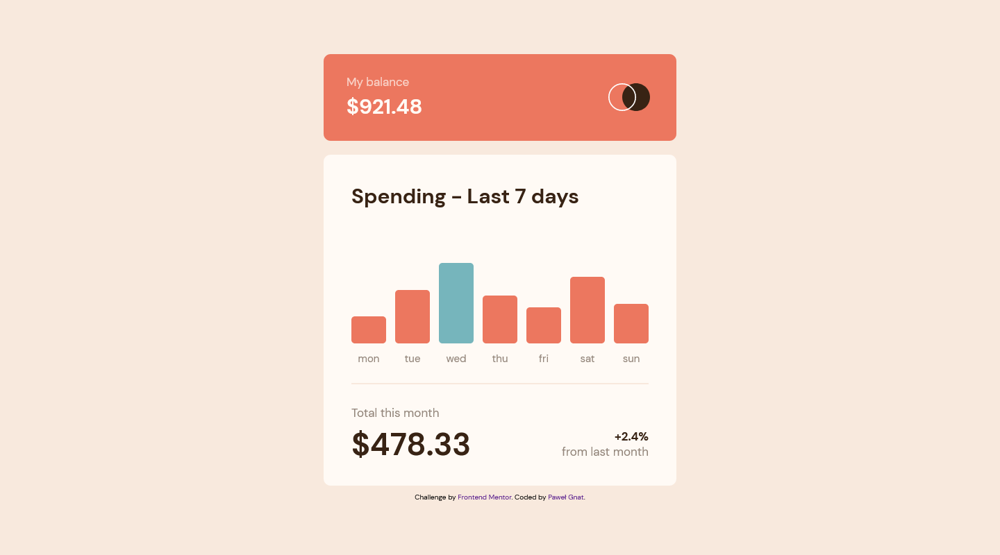

# Frontend Mentor - Expenses chart component solution

This is a solution to the [Expenses chart component challenge on Frontend Mentor](https://www.frontendmentor.io/challenges/expenses-chart-component-e7yJBUdjwt). Frontend Mentor challenges help you improve your coding skills by building realistic projects.

## Table of contents

- [Overview](#overview)
  - [Screenshot](#screenshot)
  - [Links](#links)
- [My process](#my-process)
  - [Built with](#built-with)
  - [What I learned](#what-i-learned)
- [Author](#author)

## Overview

### Screenshot

### Links

- Live Site URL: [Frontend Mentor Expenses chart component](https://pawel-gnat.github.io/Frontend-Mentor-Expenses-chart-component/)

## My process

I fetched my json data and insert them in arrays. Later, I used arrays to set height of divs and expense texts. I added a function that set a different background color of a div in relation to a current day.

### Built with

- Semantic HTML5 markup
- CSS custom properties
- Flexbox
- Mobile-first workflow
- JavaScript

### What I learned

Completed in 8 hours. At first I tried to do it with chart.js but reading the documentation and implementing it was harder than coding that task from zero. I learned to use 2 parameters in forEach loop and new Date function.

## Author

- Frontend Mentor - [@Pawel-Gnat](https://www.frontendmentor.io/profile/Pawel-Gnat)
